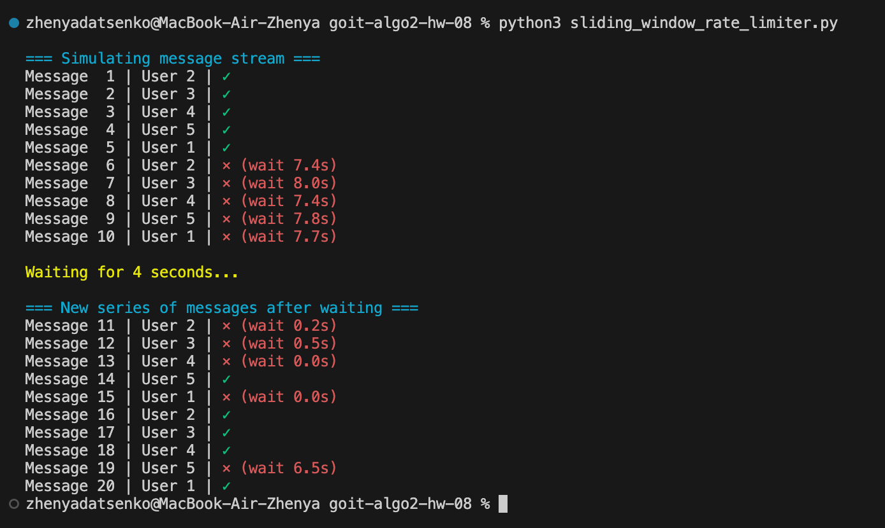
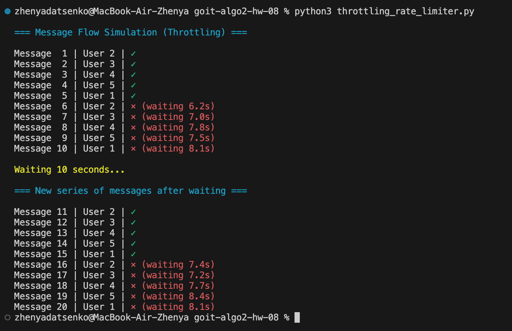

# Homework Module: Algorithms For Flow Control And Speed Limitation

This HW explores different rate limiting techniques, which are crucial for managing network traffic and preventing abuse in systems such as APIs and chat applications. Rate limiting ensures fair resource allocation and system stability by controlling the frequency at which users can perform certain actions.

## Overview

This project focuses on two rate-limiting algorithms:

- **Sliding Window**: A technique that tracks requests within a fixed time window, providing accurate rate limiting over time.
- **Throttling**: A simpler method that enforces a minimum time interval between requests, ensuring a fixed delay between successive actions.

## Task Description

The task involves implementing both the Sliding Window and Throttling algorithms in Python. Each algorithm is implemented in a separate file with a corresponding test function to demonstrate its functionality.

- **`sliding_window_rate_limiter.py`**:
  - Implement the `SlidingWindowRateLimiter` class.
  - Implement the `test_sliding_window_limiter()` function to test the rate limiter.
- **`throttling_rate_limiter.py`**:
  - Implement the `ThrottlingRateLimiter` class.
  - Implement the `test_throttling_limiter()` function to test the rate limiter.

## Results

